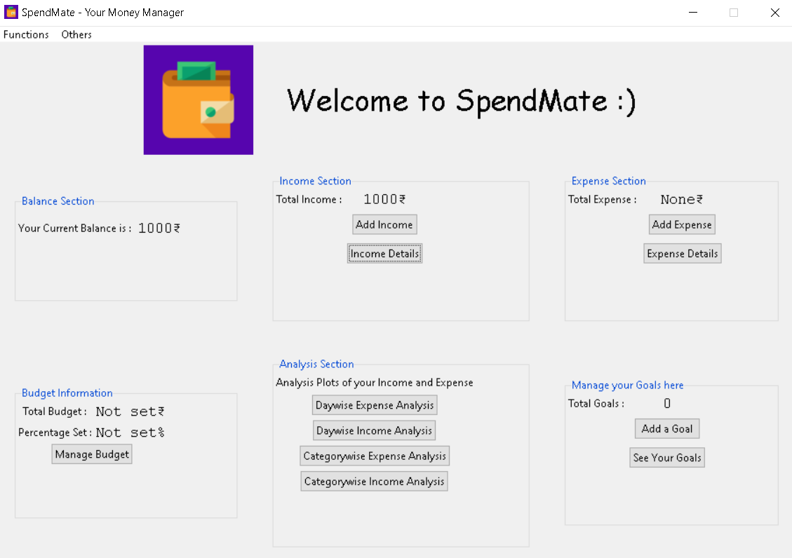

<p align="center">
  <a href="" rel="noopener">
 
</p>
<h1 align = 'center'>SpendMate - Your Money Manager</h1>

<br>

</p>  


[](https://www.python.org "Python3")
[](https://code.visualstudio.com/  "Visual Studio Code")


<br>

<h2 align='center'>Motivation</h2>
<p align='center'>
The ultimate tool for managing your personal Expenses, Budget, Analysis and for tracking your future savings.It also allows users to set budgets, get overview of money distribution and has added functionality of analyzing data using graphical representation. If you always want to be in sync and control of your budget, bills and savings, then this tool is best suited for you.Seamlessly log your personal and business transactions. analyse your revenue and expense reports with beautiful graphs. Review your daily, monthly finances easily.


<p align='center'>
<a href="https://docs.google.com/document/d/e/2PACX-1vQn_2oSdxNJglxhb0F_3OS6h94MO6FGFWZdYHcEoaNBHjI-U7sBWdCMlCo0PhWbSzzBHl1dJFCmbqry/pub">
User Manual
</a>
</p>

</p>

------------------------------------------

## 🚀 Features
- Intuitive Interface - Add, edit, Archive your financial records easily.
- Multi-currency support - you can select your currency from the list of 10+ major world currencies.
- Multiple accounts - You can create any number of accounts to manage and streamline your Income and Expense transactions.
- Graphs and Pie Charts - Gives more clarity and visual analysis of your spending areas in detail. It gives a percentage split up of your revenue and spending category wise for all the months.
- Custom Categories - If default categories do not work for you. You can simply create your own Spending and Income Categories with Built-In Icons and colors.
- Budget Management - You can set and alter your monthly budget any time. You will get an alert message on your main window when your spending has reached the budget threshold.
- Goals -Save for your future expenses by setting Goals. You can add contributions towards your goal and keep track of your saving progress to achieve your goal.

------------------------------------------

<div align="center">
<h3 align="center">App Demo</h3>
<br>
<p align="center">
  
</p>
<p align="center">
  
</p>
<p align="center">
  
</p>
<br>
  


</div>


------------------------------------------

### To-do List

- [ ] Incude support for various languages. 
- [ ] Improve design.
- [ ] Add more features.

------------------------------------------
###             Tech stack
Python ,Tkinter ,sqlite3 <br>

------------------------------------------
### Installing

A step by step series of examples that tell you how to get a development env running

In your cmd:

```
pip install virtualenv
git clone https://github.com/tushargithub44/SpendMate.git 
cd SpendMate
virtualenv env
cd env\Scripts
activate
cd ../..
```

Then,

```
pip install -r requirements.txt
python app.py
```

You are done with the setup now!

------------------------------------------

### Contributing


 We're are open to `enhancements` & `bug-fixes` . Open a PR and we'll look into it. 
 
------------------------------------------
### Contributors

- [@Tushar Bapecha](https://github.com/tushargithub44)
- [@Akshat Gandhi](https://github.com/AkshatG6)
- [@Rugved Bongale](https://github.com/rugvedb)

------------------------------------------
<h3 align="center"><b>Developed with :heart: by <a href="https://github.com/tushargithub44">Tushar</a>, <a href="https://github.com/AkshatG6">Akshat</a>, <a href="https://github.com/rugvedb">Rugved</a></b></h1>
